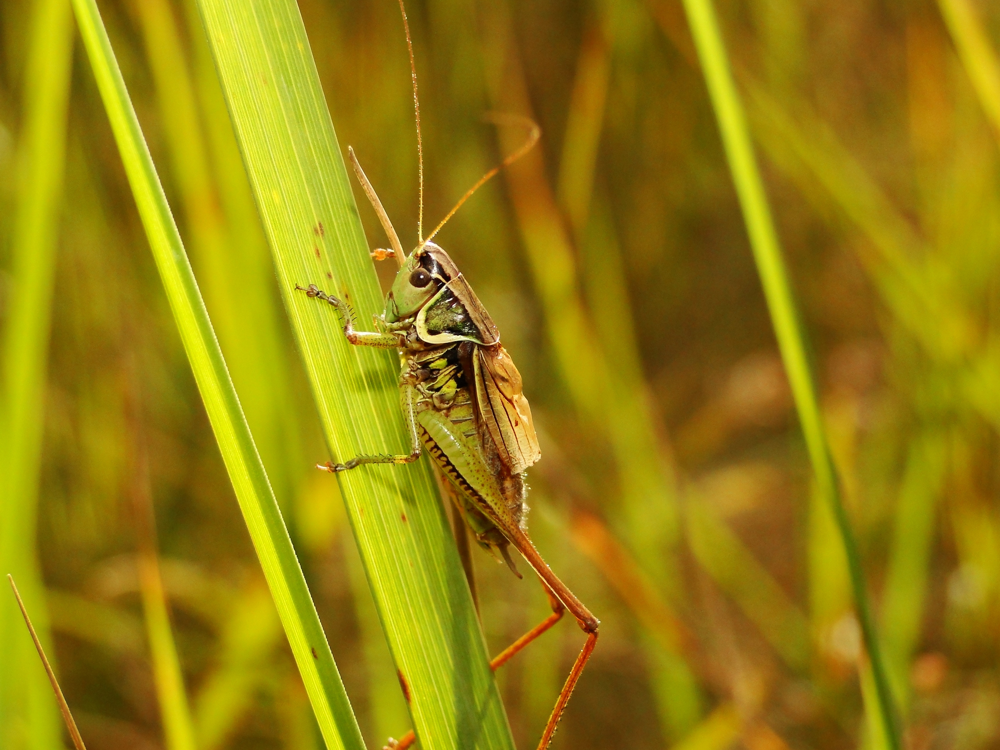

Grasshoppers have a wide range of predators at different stages of their lives; eggs are eaten by bee-flies, ground beetles and blister beetles; hoppers and adults are taken by other insects such as ants, robber flies and sphecid wasps, by spiders, and by many birds and small mammals.

The eggs and nymphs are under attack by parasitoids including blow flies, flesh flies, and tachinid flies. External parasites of adults and nymphs include mites.

The grasshopper nematode (Mermis nigrescens) is a long slender worm that infects grasshoppers, living in the insect's hemocoel. Adult worms lay eggs on plants and the host becomes infected when the foliage is eaten.

    

The fungal pathogen Metarhizium acridum is found in Africa, Australia and Brazil where it has caused epizootics in grasshoppers. It is being investigated for possible use as a microbial insecticide for locust control.

Grasshoppers exemplify a range of anti-predator adaptations, enabling them to avoid detection, to escape if detected, and in some cases to avoid being eaten if captured. Grasshoppers are often camouflaged to avoid detection by predators that hunt by sight; some species can change their coloration to suit their surroundings.

Several species such as the hooded leaf grasshopper Phyllochoreia ramakrishnai (Eumastacoidea)  are detailed mimics of leaves. Stick grasshoppers (Proscopiidae) mimic wooden sticks in form and colouration.

 
    

Some species are genuinely aposematic, having both bright warning coloration and sufficient toxicity to dissuade predators. Dictyophorus productus (Pyrgomorphidae) is a "heavy, bloated, sluggish insect" that makes no attempt to hide; it has a bright red abdomen. A Cercopithecus monkey that ate other grasshoppers refused to eat the species.

Grasshoppers are occasionally depicted in artworks, such as the Dutch Golden Age painter Balthasar van der Ast's still life oil painting, Flowers in a Vase with Shells and Insects, c. 1630, now in the National Gallery, London, though the insect may be a bush-cricket.

Another orthopteran is found in Rachel Ruysch's still life Flowers in a Vase, c. 1685. The seemingly static scene is animated by a "grasshopper on the table that looks about ready to spring", according to the gallery curator Betsy Wieseman, with other invertebrates including a spider, an ant, and two caterpillars.

Grasshoppers are also featured in cinema. The 1957 film Beginning of the End portrayed giant grasshoppers attacking Chicago.